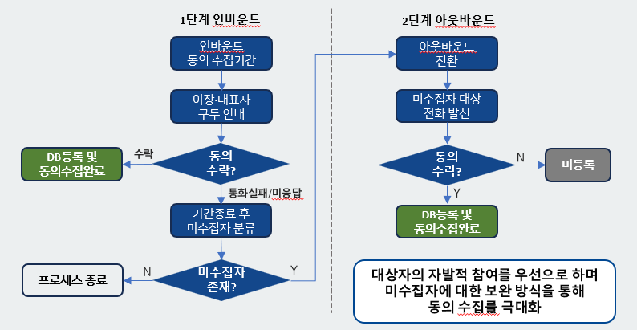

### 개인정보 제공동의 ✔️
- 인바운드 기간 설정 , 기간종료 후 미수집자 분류 
    - [✔️] 인바운드 기간 설정 테이블 필요
    - 스케줄 주기는?

- 미수집자 존재 > 아웃바운드 전환 (테이블to테이블) 
    - [✔️] 발송대기 코드 추가
    - [] 아웃바운드 테이블 UPSERT (status 체크)
        - `ars_call_status_code` default는 발송대기여야하지 않는지?
    - [✔️] 인바운드 테이블 DELETE 

- 아웃바운드 미수집자 자동 발송
    - [] 이력테이블 INSERT , 아웃바운드 테이블 DELETE
    - [] 수락 > DB 등록 및 수집완료 , 거절 > 미등록 (수동전환)

- 수동 발신 전환
    - [] 수동 발신 > STATUS 변경 시 아웃바운드 테이블 UPDATE , 이력 INSERT

- 수집 완료 시
    - [] 수집자 인바운드/아웃바운드 테이블 DELETE

- 미등록 대상 > 미등록번호에서 메시지 청취 요청 시 개인정보 수집‧이용 동의 안내 절차가 진행되어야 함
---
- 녹취파일 암호화 > 특정 모듈을 통한 재생이 될 수 있도록 구현

### 테이블 정보
- tb_temp_privacy_agree_info [인바운드 테이블]
- tb_time_privacy_agree_info [아웃바운드 테이블]
- tb_privacy_agree_info_time_mng [ARS 타임테이블 설정]
- tb_privacy_agree_info_history [개인정보제공동의 이력테이블]
- tb_user_group `privacy_agree_recipient_day` [인바운드 기간 테이블]

---

자동수집 ARS를 통해 개인정보 수집․이용에 대한 동의를 거부한 사용자는 통합 마을방송 서비스 대상자 데이터베이스에 등록되지 않도록 하여야 함
사용자가 동의를 거부한 경우 관리자가 재발신을 통해 재동의 절차를 진행할 수 있어야 함